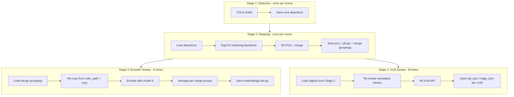

# Pipeline Stage Decomposition Plan

## Architecture Overview




## Current State (what exists today)

- `save_detections: False` in [batch_vlm_mapping_api.yaml](conceptgraph/hydra_configs/batch_vlm_mapping_api.yaml) line 14 -- detections are recomputed every run and never saved
- Mask truncation already exists at [utils.py line 317](conceptgraph/slam/utils.py) (`obj1['mask'] = obj1['mask'][-2:]`)
- `to_serializable` in [slam_classes.py line 130-155](conceptgraph/slam/slam_classes.py) already deletes `mask` but preserves `image_idx`, `color_path`, `xyxy` -- the merge groupings are implicitly in every pkl
- The `VLMEncoderExtractor` in [vlm_encoder.py](conceptgraph/utils/vlms/vlm_encoder.py) already handles a zoo of encoder families and returns CPU numpy
- The `VLMAPIClient` in [vlm_api.py](conceptgraph/utils/vlms/vlm_api.py) already handles caption + relation generation via HTTP
- TinyCLIP is loaded via `CLIPModel.from_pretrained` from HuggingFace transformers at [batch_vlm_mapping_api.py lines 307-327](conceptgraph/slam/vlm_run/batch_vlm_mapping_api.py)

## Stage 1: Detection-Only Mode

**Goal:** Run YOLO+SAM once per scene, save core detections to disk.

**File:** [batch_vlm_mapping_api.py](conceptgraph/slam/vlm_run/batch_vlm_mapping_api.py)

- Add a `detection_only` config flag (default `false`). When `true`, the main loop runs YOLO+SAM, saves `raw_gobs` (with `save_detections` forced `true`), then skips the entire mapping/merge section and exits after all frames are processed.
- The saved `raw_gobs` keys per frame are: `xyxy`, `confidence`, `class_id`, `mask`, `classes`, `detection_class_labels`. When in detection-only mode, skip computing `image_crops`, `image_feats`, `text_feats`, `captions`, `edges`, `vlm_vit_feats`, `vlm_proj_feats` -- set them to `None`/empty and don't save them.
- The `save_detection_results` function in [general_utils.py line 554](conceptgraph/utils/general_utils.py) already handles per-key save (npz for numpy, pkl.gz for everything else). Modify it to skip keys whose value is `None`.

**Config change:** [batch_vlm_mapping_api.yaml](conceptgraph/hydra_configs/batch_vlm_mapping_api.yaml)

- Flip `save_detections: !!bool True`
- Add `detection_only: !!bool False`

## Stage 2: Definitive Mapping with SigLIP2

**Goal:** One mapping run per scene using SigLIP2-SO400M as the matching backbone, producing the definitive object list with merge groupings.

**File:** [batch_vlm_mapping_api.py](conceptgraph/slam/vlm_run/batch_vlm_mapping_api.py)

- Replace TinyCLIP init (lines 307-327) with a configurable matching model. Add a `matching_model` config key (default `google/siglip2-so400m-patch14-384`). SigLIP2 loads via `AutoModel.from_pretrained` + `AutoProcessor.from_pretrained` from HuggingFace transformers -- same pattern as current TinyCLIP but using `AutoModel`/`AutoProcessor` instead of `CLIPModel`/`CLIPProcessor`.
- Refactor `compute_tinyclip_features_batched` (lines 166-234) into a generic `compute_matching_features_batched` that works with either CLIPModel or SigLIP2's AutoModel. Both expose `get_image_features(**inputs)` and `get_text_features(**inputs)`. The key difference: replace `clip_model.config.projection_dim` with a dynamic dim lookup (SigLIP2 uses a different config key).
- When `force_detection=False` and saved detections exist, the script loads from disk and skips YOLO+SAM. The `raw_gobs` loaded from Stage 1 will have `None` for `image_feats` etc., so the mapping loop must compute the matching model features on-the-fly from `image_crops` (which it generates from `color_path` + `xyxy`).
- Add `make_edges: false` for Stage 2 runs -- no VLM server needed.

**New artifact -- merge groupings:** After the mapping loop completes, before final saves, serialize a `merge_groupings.pkl.gz` alongside the existing `pcd_*.pkl.gz`. This is a dict:

```python
{
    str(obj['id']): {
        'class_name': obj['class_name'],
        'image_idx': obj['image_idx'],      # list of frame indices
        'color_path': obj['color_path'],     # list of Path objects
        'xyxy': obj['xyxy'],                 # list of (4,) arrays
        'num_detections': obj['num_detections'],
    }
    for obj in objects
}
```

This is ~30 lines added at the end of the `main()` function, right before the final save block (line ~718).

## Stage 3: Encoder Sweep Script (new file)

**Goal:** For each encoder model, re-encode crops using the merge groupings from Stage 2, average embeddings per object, save to disk.

**New file:** `conceptgraph/slam/vlm_run/encoder_sweep.py` (~150-200 lines)

**Logic:**

1. Load `merge_groupings.pkl.gz` from Stage 2 output dir
2. For each object, iterate over `(color_path, xyxy)` pairs to generate PIL crops (same padding logic as `compute_tinyclip_features_batched`)
3. Load the specified encoder using `VLMEncoderExtractor` (already handles Ovis, Qwen, InternVL, SmolVLM, etc.) or a new generic CLIP/SigLIP loader for non-VLM encoders
4. Encode all crops per object, average with equal weighting, L2-normalize
5. Save as `embeddings/<encoder_name>.pkl.gz` in the experiment directory -- a simple dict `{obj_id: np.ndarray}`
6. Accepts CLI args: `--groupings_path`, `--encoder_name`, `--model_id`, `--device`, `--output_dir`

**Encoder loading:** Extend `VLMEncoderExtractor` with a static factory method that also handles standalone CLIP/SigLIP models (not just VLM vision towers). Or create a parallel `StandaloneCLIPEncoder` class in the same file that wraps `AutoModel.from_pretrained` for CLIP/SigLIP families. Return the same `(vit_feats, proj_feats)` tuple signature.

**VRAM:** Each encoder is 100MB-1.5GB. Multiple instances can run in parallel (4-5 on 16GB).

## Stage 4: VLM Caption Sweep Script (new file)

**Goal:** For each VLM, run captioning/relations on the already-identified objects from Stage 2.

**New file:** `conceptgraph/slam/vlm_run/vlm_caption_sweep.py` (~200 lines)

**Logic:**

1. Load `merge_groupings.pkl.gz` from Stage 2
2. For each object, pick the frame with the highest confidence detection (from `conf` in the groupings, or just the first frame)
3. Load the original image from `color_path`, annotate with all detection bboxes from that frame using `sv.BoxAnnotator` + `sv.LabelAnnotator` (same as `make_vlm_edges_and_captions` in batch_vlm_mapping_api.py lines 91-139)
4. Call `VLMAPIClient.caption_objects_with_labels()` and `VLMAPIClient.infer_relations_with_labels()` from [vlm_api.py](conceptgraph/utils/vlms/vlm_api.py)
5. Run `consolidate_captions()` on the accumulated per-frame captions
6. Save updated `obj_json_<vlm_name>.json` and `edge_json_<vlm_name>.json`

**Requires:** A running vLLM server for the target VLM. The existing shell script vLLM lifecycle management can be reused.

## Stage Orchestration Shell Script

**New file:** `shells/run_staged_pipeline.sh` (~100 lines)

**Structure:**

```
STAGE="${STAGE:-all}"  # all | detect | map | encode | caption

case $STAGE in
  detect|all)   run Stage 1 for all scenes ;;
  map|all)      run Stage 2 for all scenes ;;
  encode|all)   run Stage 3 for each ENCODER in ENCODER_LIST ;;
  caption|all)  run Stage 4 for each VLM in VLM_LIST ;;
esac
```

- `ENCODER_LIST` -- space-separated model IDs for the encoder sweep
- `VLM_LIST` -- space-separated model IDs for the VLM caption sweep
- Stages 3 and 4 can run in parallel (no GPU contention between small encoders)
- Stage 4 starts/stops vLLM per VLM model (reuse `start_vllm`/`cleanup_vllm` from [run_vllm_batch.sh](shells/run_vllm_batch.sh))

## Files Changed Summary

- **[conceptgraph/hydra_configs/batch_vlm_mapping_api.yaml](conceptgraph/hydra_configs/batch_vlm_mapping_api.yaml)** -- flip `save_detections` to True, add `detection_only` and `matching_model` config keys
- **[conceptgraph/slam/vlm_run/batch_vlm_mapping_api.py](conceptgraph/slam/vlm_run/batch_vlm_mapping_api.py)** -- add detection-only early exit, swap TinyCLIP init to configurable matching model, add merge_groupings save, refactor `compute_tinyclip_features_batched` to generic
- **[conceptgraph/utils/general_utils.py](conceptgraph/utils/general_utils.py)** -- skip None values in `save_detection_results`
- **[conceptgraph/utils/vlms/vlm_encoder.py](conceptgraph/utils/vlms/vlm_encoder.py)** -- add factory method for standalone CLIP/SigLIP encoders
- **NEW: [conceptgraph/slam/vlm_run/encoder_sweep.py](conceptgraph/slam/vlm_run/encoder_sweep.py)** -- encoder re-encoding script
- **NEW: [conceptgraph/slam/vlm_run/vlm_caption_sweep.py](conceptgraph/slam/vlm_run/vlm_caption_sweep.py)** -- post-hoc VLM captioning script
- **NEW: [shells/run_staged_pipeline.sh](shells/run_staged_pipeline.sh)** -- orchestration script

